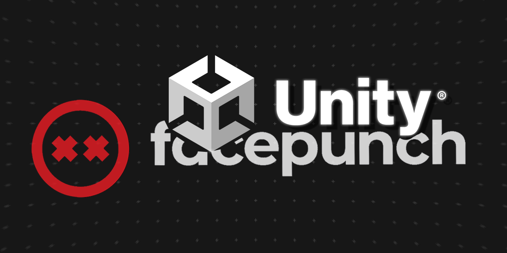

<div align="center">
  
[](https://github.com/mrrobinofficial/guide-unitysteamnetcodegameobjects/blob/HEAD/LICENSE.txt)


</div>

#

<center>
    <p>
        <i>
            This repo is a comprehensive repository designed to help users quickly and effectively get started with Unity's multiplayer solutions using Facepunch as the transport layer and Unity's Netcode For GameObjects framework.
        </i>
    </p>
</center>

## ⚙️ Before you begin

Netcode supports the following versions:

* Unity 2021.3 and later
* Mono and IL2CPP Scripting Backends

Netcode supports the following platforms:

* Windows, macOS, and Linux
* iOS and Android
* XR platforms running on Windows, Android, and iOS operating systems

You can read more about **Unity Multiplayer Networking** docs [here](https://docs-multiplayer.unity3d.com/).

## ⚒️ How to Install

If you haven't install Unity Netcode For GameObjects, then do so via this [link](https://docs-multiplayer.unity3d.com/netcode/current/installation/install).

Then install [Facepunch Transport](https://github.com/Unity-Technologies/multiplayer-community-contributions/tree/main/Transports/com.community.netcode.transport.facepunch) layer.

Or copy this git command and paste in Package Manager:

```console
https://github.com/Unity-Technologies/multiplayer-community-contributions.git?path=/Transports/com.community.netcode.transport.facepunch
```

Then you have [wiki page](https://wiki.facepunch.com/steamworks/) for API and more documentation code.

## 📝 How To Use It

You need to assign SteamId to FacepunchTransport

```csharp
private void HandleTransport(SteamId id)
{
    // Lorem Ipsum
    NetworkManager.Singleton.GetComponent<FacepunchTransport>().targetSteamId = id;
}
```

By using callback from steam, you can send that information to FacepunchTransport
```csharp
private void Start()
{
    SteamFriends.OnGameLobbyJoinRequested += OnGameLobbyJoinRequested; // Add the callback
}

private void OnDestroy()
{
    SteamFriends.OnGameLobbyJoinRequested -= OnGameLobbyJoinRequested; // Remove the callback
}

private void OnGameLobbyJoinRequested(Lobby lobby, SteamId id)
{
    HandleTransport(id);
}
```

After you got the callbacks and also changing `targetSteamId` in `FacepunchTransport`, is pretty much the same stuff with Unity Netcode For GameObjects.

Highly recommend watching [DapperDino's playlist](https://www.youtube.com/playlist?list=PLS6sInD7ThM2_N9a1kN2oM4zZ-U-NtT2E) over Unity Netcode For GameObjects.

## 🔗 Helpful Links

* [Multiplayer Community Contributions](https://github.com/Unity-Technologies/multiplayer-community-contributions/)
* [Facepunch Transport for Netcode for GameObjects](https://github.com/Unity-Technologies/multiplayer-community-contributions/tree/main/Transports/com.community.netcode.transport.facepunch)
* [Facepunch Wiki Page](https://wiki.facepunch.com/steamworks/)
* [Steamworks API](https://partner.steamgames.com/doc/api)
* [DapperDino's playlist over Unity Netcode For GameObjects](https://www.youtube.com/playlist?list=PLS6sInD7ThM2_N9a1kN2oM4zZ-U-NtT2E)

## 🆘 Support
If you have any questions or issue, just write either to my [YouTube channel](https://www.youtube.com/@mrrobinofficial), [Email](mailto:mrrobin123mail@gmail.com) or [Twitter DM](https://twitter.com/MrRobinOfficial).
